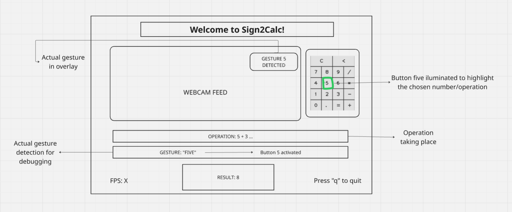

# Gesture Controls (single-hand)

This section documents the single-hand gesture design used by Sign2Calc. It aims to be concise, implementation-ready, and focuses on robustness, accessibility and simple UX.

**Note:** These specific gestures were chosen because they are the ones MediaPipe detects most reliably and consistently based on testing.

### Design principles

- **Single hand only** to reduce occlusion and detection complexity.
- **Minimal and highly distinct gestures** that lower classification errors that could occur with one-to-ten finger counting.
- **Incremental digit entry**, following `activate -> increment -> confirm`.
- **Visual feedback** in UI to close the interaction loop.
- **MediaPipe-optimized gestures** selected for maximum detection accuracy.

---

## Gesture map

|          Gesture | Action                    |
| ---------------: | ------------------------- |
|         👊*Fist* | Start digit (cursor at 0) |
|        ☝️*Index* | Increment (+1 per repeat) |
|  ✌️*Two fingers* | Confirm digit             |
|    ✋*Open palm* | Addition (+)              |
|     👍*Thumb up* | Subtraction (−)           |
| 🤙*Pinky (only)* | Multiplication (×)        |
|        🤙*Shaka* | Division (÷)              |
|      👌*OK sign* | Equals (=)                |

## Interaction flow example

**Goal:** compute `15 + 8`

1. `👊` → enter digit mode (digit = 0)
2. `☝️` ×1 → digit = 1
3. `✌️` → confirm → first operand = `1`
4. `👊` → enter digit mode
5. `☝️` ×5 → digit = 5
6. `✌️` → confirm → operand = `15`
7. `✋` → select addition (+)
8. `👊` → enter digit mode
9. `☝️` ×8 → digit = 8
10. `✌️` → confirm → second operand = `8`
11. `👌` → compute → UI shows `23`

## Detection heuristics

- **Hold threshold for static gestures** 0.5-1s to accept in order to reduce false positives due to hand movements.
- **Increment cooldown**: allow one increment per 0.5s while holding index for repeated increments.
- **Confirmation cooldown:** 0.5 s after confirm gestures to avoid duplicates.
- **Input timeout:** 5–8 s inactivity → auto-save or cancel digit entry.
- **Swipe threshold:** minimum speed/distance to qualify as delete.

---

## UI & feedback

  

- Show current digit, full operand, and active operation clearly on screen.
- Provide instant visual affordance when a gesture is detected (icon + brief animation + optional sound).
- Include an on-screen fallback control (button/keyboard) for accessibility and robustness.

## Why this approach

This gesture system prioritizes reliability and accessibility by using a small set of highly distinctive hand shapes that are easy to detect and hard to confuse.

**MediaPipe Detection Optimization:** Through testing, these specific gestures (fist, index, two fingers, palm, thumb up, pinky only, shaka, and middle finger) were found to be the most reliably detected by MediaPipe's hand landmark detection system. They provide clear finger position patterns that minimize false positives and confusion between gestures.

By relying on a single hand, we avoid occlusion issues while keeping interactions simple and natural. The incremental entry pattern scales to any number without adding complexity, and the straightforward gestures work well for users with varying levels of hand mobility, making the calculator genuinely more inclusive.
